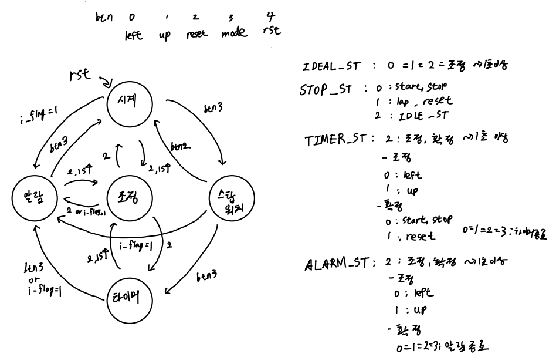
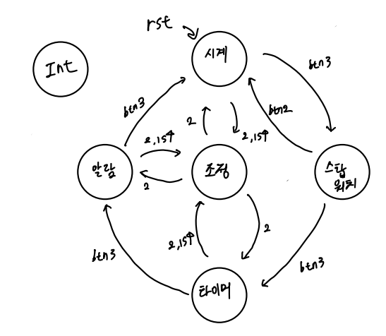
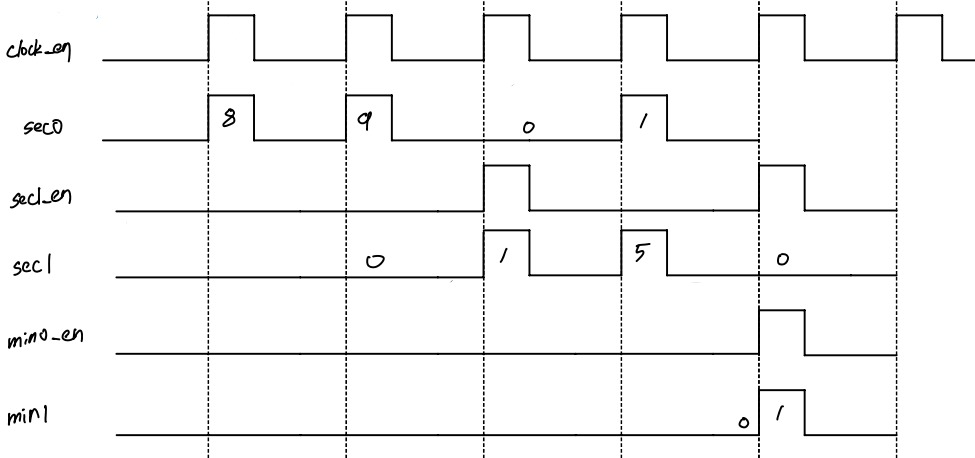

# Digital Clock with Verilog

## FSM 구상

|       <b>FSM 1안</b>       |
| :------------------------: |
|  |

|       <b>FSM 2안</b>        |
| :-------------------------: |
| ) |

---

## 동작 구상 1안

- seg_data의 LSB 점은 시, 분, 초 구분하는 점으로 사용
- a_INT Flag 0으로 설정. interrupt Flag 1로 뜨면 ALARM_ST 로 넘어감.
- btn[4] 누르면 모든 데이터 초기화, IDLE_ST로 이동.

### 조정 모드

> btn[0] 누르면 커서가 왼쪽으로 이동. 
> 해당 digit의 seg_com에 0.5초동안 1 (불들어오고) 0.5초동안 0 넣어서 불꺼지는 깜빡임 발생 
> btn[1] 누르면 커서 있는 숫자 증가. 
> btn[2] 누르면 들어왔던 상태로 되돌아감 
> btn[3] 누르면 들어왔던 상태의 다음 상태로 넘어감 

### 시계 모드

> btn[0], btn[1], btn[2] 모두 같은 동작. 
> 상기 버튼을 1초 이상 누르면 조정 모드로 state 넘어감. 
> btn[3] 누르면 다음 state로 넘어감 

### 스탑워치 모드

> watch Flag이 0일때, btn[0] 누르면 flag 1로 올리고 stop watch 시작, led 동작 
> watch Flag이 1일때, btn[0] 누르면 flag 0으로 내리고 stop watch 멈춤, led 멈춤 
> watch Flag이 0이고 lap Flag이 0일때, btn[1] 누르면 stop watch 초기화, led 꺼짐 
> watch Flag이 1이고 lap Flag이 0일때, btn[1] 누르면 보여주는 값 고정하고 백그라운드에서 스탑워치 동작, lap Flag 1로 
> lap Flag이 1일때, btn[1] 누르면 lap flag 0으로 내리고 현재 stop watch 값 보여줌. 
> btn[2] 누르면 IDLE_ST 로 돌아감. 
> btn[3] 누르면 다음 state 

### 타이머 모드

> t_INT Flag이 1일때, btn[0]=btn[1]=btn[2]=btn[3] 누르면 타이머 종료, t_Int Flag 0으로 내림. 
> seg_data가 00:00:00 일때 btn[0] 누르면 아무 동작 안함 
> timer Flag 1일때, btn[0] 누르면 타이머 중지, timer Flag 0으로 내림 
> 그 외 btn[0] 누르면 타이머 시작, timer Flag 1로 올림 
> btn[1] 누르면 타이머 0으로 리셋, timer Flag 0으로 내림 
> btn[2] 1초 이상 누르면 조정 모드로 state 넘어감. 
> timer Flag이 0일때, btn[3] 누르면 다음 state로 넘어감. 

### 알람 모드

> a_INT Flag 1로 떴을 때, btn[0] = btn[1] = btn[2] = btn[3] 알람 종료, interrupt Flag 0으로 내려감 
> alarm Flag = 0일때, btn[0] = btn[1] 1초 이상 누르면 알람 켜짐 
> alarm Flag = 1일때, btn[0] = btn[1] 1초 이상 누르면 알람 꺼짐 
> btn[2] 1초 이상 누르면 조정 모드로 state 넘어감, alarm Flag 1로 올림 
> btn[3] 누르면 다음 state로 넘어감 

---

## 동작 구상 2안

- 1안에서 알람이나 타이머가 울리는 상태를 INT_ST로 state를 추가한 모델

---

## 7-Segment

dec_in : 0부터 9까지 input 숫자. dec_out : 7-segment 데이터
|<b>7-Segment</b> |
| :--: |
| |

| dec_in |  dec_out   |
| :----: | :--------: |
|  0000  | 1111110, 0 |
|  0001  | 0110000, 0 |
|  0010  | 1101101, 0 |
|  0011  | 1111001, 0 |
|  0100  | 0110011, 0 |
|  0101  | 1011011, 0 |
|  0110  | 1011111, 0 |
|  0111  | 1110010, 0 |
|  1000  | 1111111, 0 |
|  1001  | 1111011, 0 |

---

## 시계 타이밍도 구상

